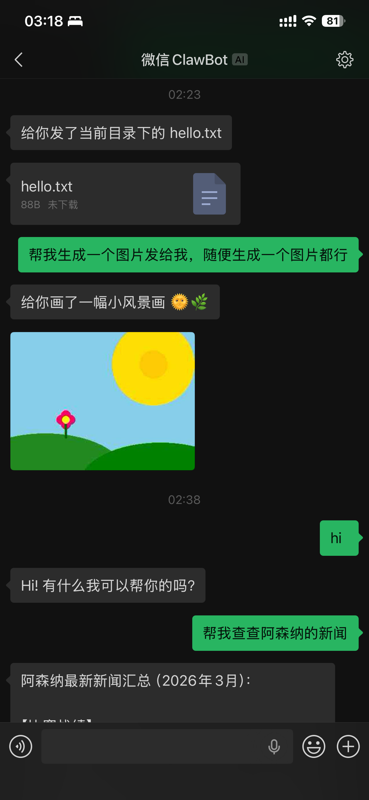

# claude-code-wechat

微信频道插件，通过 iLink Bot API 将微信消息接入 Claude Code 会话。支持文字、图片、文件、视频和语音收发。

[English](./README.en.md)



## 前置条件

- **[Claude Code](https://claude.com/claude-code)** v2.1.80+
- **[Bun](https://bun.sh)** — `curl -fsSL https://bun.sh/install | bash`
- **微信** 8.0.70+

## 安装

**1. 添加插件市场并安装**

```
/plugin marketplace add swim2sun/swim2sun-plugins
/plugin install wechat@swim2sun-plugins
```

安装完成后需要重启 Claude Code 以加载插件。

**2. 登录**

```
/wechat:configure login
```

按 ctrl+o 展开输出查看完整二维码，或直接在微信中打开输出中的链接完成登录。登录完成后按 ctrl+o 关闭二维码。

**3. 启用频道**

重启 Claude Code 以启用微信频道：

```sh
claude --dangerously-load-development-channels plugin:wechat@swim2sun-plugins
```

> 推荐加上 `--dangerously-skip-permissions` 参数，否则编辑文件、执行命令会频繁请求权限。权限请求只会出现在 Claude Code 终端中，不会出现在微信端。

在微信上给你的 ClawBot 发一条消息，消息会出现在 Claude Code 会话中。

## 许可证

MIT
